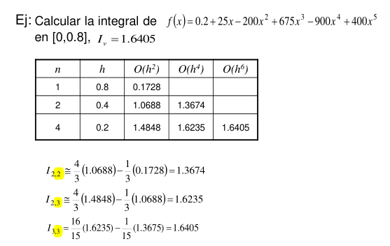

# Unidad 3 - Sistemas de ecuaciones lineales

## 🔍 Objetivo

Resolver sistemas del tipo:

$$
A \cdot x = b
$$

donde $A \in \mathbb{R}^{n \times n}$, $x$ es el vector incógnita y $b$ el vector de constantes. Se usan métodos numéricos para evitar errores acumulativos y reducir el costo computacional.

## 🔸 Tipos de Matrices

**DENSAS:** Son aquellas que poseen pocos elementos nulos y son de orden bajo\
**RALAS (SPARSE):** Son aquellas que poseen muchos ceros y son de orden alto

## 🔸 Tipos de Métodos

### 1. **Métodos Directos**

Son aquellos que nos conducirían a la solución exacta luego de un número finito de operaciones elementales, si no hubiera errores de redondeo

### 🟢 **Eliminación de Gauss**

#### 🔍 Objetivo

Transforma el sistema en forma escalonada superior usando operaciones elementales a la matriz ampliada (modifica b) y luego se resuelve con **sustitución hacia atrás**.

**Errores comunes:**

- El error de redondeo se acumula en cada paso.
- Matrices mal condicionadas pueden amplificar errores.
- Sin pivoteo, puede fallar o generar grandes errores numéricos si hay ceros o valores muy pequeños en la diagonal.

### 💡 Ventajas

- Método **general**: se puede aplicar a cualquier sistema no singular.
- Base de otros métodos como LU, Thomas (caso tridiagonal), y muchos algoritmos numéricos.
- Se puede mejorar con:

  - **Pivoteo parcial** (mayor estabilidad).
  - **Escalamiento** (evita errores por magnitudes muy diferentes).

### ⚠️ Requisitos

- La matriz debe ser **no singular**.

### 💻 Complejidad

- Eliminación (reducción a triangular superior):$ O\left( \frac{2}{3} n^3 \right)$
- Sustitución hacia atrás:$ O(n^2) $
- **Total:** $O(n^3)$

---

### 🟢 **Factorización LU**

#### 🔍 Objetivo

Descompone $A = L \cdot U$, donde $A$ debe ser **no singular**, y para LU sin pivoteo, debe ser posible evitar ceros en la diagonal de $U$:

- $L$: matriz triangular inferior con unos en la diagonal
- $U$: matriz triangular superior
- Luego resuelve $L \cdot y = b$, y $U \cdot x = y$

#### 💡 Ventajas

- Útil para resolver muchos sistemas con la misma matriz $A$ y distintos vectores $b$.
- Se puede calcular $|A| = |L.U| = |U|$
- Cálculo de $A^{-1}$ usando como b las columnas canónicas
- Se puede combinar con **pivoteo parcial escalado** para mayor estabilidad

### 💻 Complejidad

- **Factorización LU:** $ O\left( \frac{2}{3} n^3 \right) $
- **Sustituciones (hacia adelante y hacia atrás):** $ O(n^2) $
- **Total por un sistema:** $ O(n^3) $
- **Total si ya tenés la factorización (solo resolver para otro $b$):** $ O(n^2) $

### **Pivoteo parcial**

- Wilkinson propuso que; en cada paso de la eliminación de Gauss, buscar en la columna actual **entre las filas restantes** (desde la fila pivote hacia abajo)  el elemento con mayor valor absoluto y elegirlo como pivot, con el objetivo de evitar divisiones por números muy pequeños (o $0$) de tal forma que los multiplicadores $|m_{ik}| \leq 1$, evitando aumentar errores de redondeo.
- **Vector $P$ (permutaciones):**
  Registra el orden actual de las filas luego de los intercambios durante la eliminación. Inicialmente, $P = [1, 2, ..., n]^t$. Cada vez que se intercambian filas $i$ y $k$, se intercambian también $P_i \leftrightarrow P_k$. Útil para mantener la correspondencia entre filas originales y filas actuales, sin mover físicamente toda la matriz (optimización).

### **Escalamiento Implicito**

- Wilkinson propone que una matriz debe equilibrarse antes de aplicar una algoritmo de solucion. Se basa en **normalizar la comparación de valores en cada fila según la magnitud relativa en su fila** para elegir mejor el pivote. Por lo que para cada fila $i$, se calcula su factor de escala en $S$:

- **Vector $S$ (escalas):**
  Guarda para cada fila $i$ el valor máximo absoluto de sus coeficientes en la matriz original $A$:

$$
S_i = \max_{1 \leq j \leq n} |a_{ij}|
$$

- Al elegir el pivote, no se mira solo el valor absoluto del elemento de la columna $k$, sino el cociente: $ c_k =\max{1 \leq j \leq n} \frac{|a_{ij}^k| }{S_i} $ haciendo una comparación justa y relativa

### ⚙️ Funcionamiento resumido del ppe:

1. Se calcula $S$ antes de comenzar la eliminación y $P$ se inicializa desde 1 hasya n.
2. En cada paso $k$, para elegir fila pivote $p$, se evalúa: $ c_i = \frac{|a_{ik}|}{S_i}$

3. Se intercambian filas $k$ y $p$ tanto en la matriz como en $P$.
4. Se continúa con la eliminación habitual.
5. Al resolver queda: $PLU x = b \implies L y = P b \implies U x = y$. Es decir, debemos aplicar la permutacion a b.

#### 📝 Beneficios

- Permite hacer pivoteo con una comparación justa considerando la escala de cada fila.
- Mejora estabilidad y evita errores numéricos.
- El vector $P$ facilita reconstruir la solución o aplicar permutaciones posteriores sin perder datos.

---

### 🟢 Metodo de Gauss Jordan

Es similar al método de Gauss, la diferencia es que se diagonaliza la matriz

Al finalizar el algoritmo tenemos $𝑥 = b^n$

Desventaja: Costo aumenta en 50%

### 🟢 Descomposición de Cholesky

#### 🔍 Objetivo

Resolver $A x = b$ cuando $A$ es **simétrica y definida positiva**.

#### 📐 Descomposición:

$$
A = L \cdot L^T
$$

- $L$: matriz triangular inferior con coeficientes reales, incluso en su diagonal.
- Luego se resuelven:

$$
L y = b \quad \text{(sustitución hacia adelante)}
$$

$$
L^T x = y \quad \text{(sustitución hacia atrás)}
$$

### 🧮 Fórmulas por componentes

Para construir $L$, se recorren filas y columnas de forma incremental. Los elementos se calculan así:

#### 🟩 Diagonal ($i = j$):

$$
\ell_{ii} = \sqrt{ a_{ii} - \sum_{k=1}^{i-1} \ell_{ik}^2 }
$$

#### 🟦 Debajo de la diagonal ($i > j$):

$$
\ell_{ji} = \frac{1}{\ell_{ii}} \left( a_{ji} - \sum_{k=1}^{i-1} \ell_{jk} \ell_{ik} \right)
$$

### 💡 Ventajas

- Es **más eficiente** y **más estable** que la LU tradicional si se cumplen las condiciones.
- Requiere casi la **mitad del trabajo** que LU.
- No necesita pivoteo
- Ideal para matrices simétricas dispersas.

### 💻 Complejidad

- Descomposición: $O\left( \frac{1}{3} n^3 \right)$ (mitad que LU)
- Sustituciones: $O(n^2)$

---

### 🟢 Método de Thomas (tridiagonal)

#### 🔍 Objetivo

Resolver sistemas donde $A$ es **tridiagonal**, sólo tiene elementos distintos de cero en la diagonal principal y las diagonales adyacentes, es decir:

$$
\begin{bmatrix}f_1 & g_1 & 0   & \cdots & 0 \\e_2 & f_2 & g_2 & \cdots & 0 \\0   & e_3 & f_3 & \ddots & \vdots \\\vdots & \ddots & \ddots & \ddots & g_{n-1} \\0 & \cdots & 0 & e_n & f_n\end{bmatrix} .
\begin{bmatrix}x_1 \\x_2 \\x_3 \\\vdots \\x_{n-1} \\x_n\end{bmatrix} =
\begin{bmatrix}r_1 \\r_2 \\r_3 \\\vdots \\r_{n-1} \\r_n\end{bmatrix}
$$

### 🧠 Algoritmo

#### Descomposición

Para $k = 2$ hasta $n$: $e_k = \frac{e_k}{f_{k-1}}$; $f_k = f_k - e_k \cdot g_{k-1} $

#### Sustitución hacia adelante

Para $k = 2$ hasta $n$: $r_k = r_k - e_k \cdot r_{k-1} $

#### Sustitución hacia atrás

$x_n = {r_n}/{f_n}$ \
Para $k = n-1$ hasta $1, -1$ : $x_k = \frac{r_k - g_k \cdot x_{k+1}}{f_k} $

Es una forma optimizada de **eliminación de Gauss** que aprovecha la estructura tridiagonal para:

1. **Eliminar los elementos debajo de la diagonal** de forma eficiente
2. **Resolver con sustitución hacia atrás**

### 💡 Ventajas

- No requiere almacenar toda la matriz → solo 3 vectores
- Precisión superior a métodos genéricos al reducir operaciones

### 💻 Complejidad

- Fase de eliminación: $O(n)$
- Fase de sustitución: $O(n)$
- **Total:** $O(n)$

---

### 📌 Comparativa final de métodos directos

| Método       | Requisitos principales                      | Complejidad                                    | Ventajas clave                                                           |
| ------------ | ------------------------------------------- | ---------------------------------------------- | ------------------------------------------------------------------------ |
| **Gauss**    | No singular y $a_{ii} \neq 0$ (sin pivoteo) | $O(n^3)$                                       | General, robusto, base de muchos otros métodos                           |
| **LU**       | No singular y $a_{ii} \neq 0$ (sin pivoteo) | $O(n^3)$ (una vez)   $O(n^2)$ (por sistema) | Reutilizable para varios $b$, más eficiente que Gauss en ese caso        |
| **Cholesky** | **Simétrica definida positiva**             | $O\left(\frac{1}{3} n^3 \right)$               | Más rápido y estable que LU si aplica; usa menos operaciones             |
| **Thomas**   | **Tridiagonal**                             | $O(n)$                                         | Extremadamente eficiente; ideal para sistemas grandes con esa estructura |

---

### 2. Metodos iterativos

## 🔍 Objetivo

Resolver sistemas lineales $A x = b$ mediante **aproximaciones sucesivas**, comenzando con una estimación inicial $x^{(0)}$, que en principio convergen a la solucion x:

$$
x^{(k+1)} = B(x^{(k)}) + C
$$

B se llama matriz de iteración, es una generalización del método de punto fijo.

Se aplican principalmente cuando el sistema es de **gran tamaño** o **disperso (sparse)**.

### 💡 Ventajas respecto a los metodos directos

- Número de operaciones
- Posiciones de memoria
- Errores de redondeo

## 🔸 Tipos de Métodos Iterativos

- **Jacobi**
- **Gauss-Seidel**
- **SOR (Successive Over-Relaxation)**

---

## 🟢 Método de Jacobi

### 🔧 Ecuaciones base

Dado el sistema:

$$
A x = b \quad \Rightarrow \quad a_{ii} x_i^{(k+1)} = b_i - \sum_{j \neq i} a_{ij} x_j^{(k)}
$$

$$
x_i^{(k+1)} = \frac{1}{a_{ii}} \left( b_i - \sum_{j \neq i} a_{ij} x_j^{(k)} \right)
$$

> Cada componente se calcula **usando solo valores de la iteración anterior** $\rightarrow$ Aproximaciones simultaneas.

### 💡 Ventajas

- Muy sencillo de implementar.
- Fácil de paralelizar (cada ecuación es independiente de las demás en cada iteración).

### ⚠️ Requisitos

- La matriz no debe tener ceros en la diagonal.

### 💻 Complejidad

- Cada iteración: $O(n^2)$
- Número de iteraciones depende de la convergencia (condición del sistema).

---

## 🟢 Método de Gauss-Seidel

### 🔧 Ecuación de iteración

$$
x_i^{(k+1)} = \frac{1}{a_{ii}} \left( b_i - \sum_{j < i} a_{ij} x_j^{(k+1)} - \sum_{j > i} a_{ij} x_j^{(k)} \right)
$$

> Se usa **inmediatamente** cada nuevo valor calculado $x_j^{(k+1)}$ para actualizar el siguiente.

### 💡 Ventajas

- Mejora notablemente la velocidad de convergencia respecto a Jacobi.
- Menor consumo de memoria (no requiere vector auxiliar).
- Adecuado para sistemas **grandes y dispersos**.

### ⚠️ Requisitos

- No siempre converge si A tiene mala condición.

### 💻 Complejidad

- Cada iteración: $O(n^2)$
- Menos iteraciones que Jacobi (aunque más difíciles de paralelizar).

### 📉 Observaciones (Chapra)

- En la práctica, se usa como base para aceleración (como en SOR).
- Más susceptible a errores si hay malas estimaciones iniciales.

---

## 🟢 Método SOR (Relajación Sucesiva)

Este método usa un factor de ponderación para mejorar el valor calculado.

### 🔧 Ecuación iterativa

$$
x_i^{(k+1)} = (1 - \omega) x_i^{(k)} + \frac{\omega}{a_{ii}} \left( b_i - \sum_{j < i} a_{ij} x_j^{(k+1)} - \sum_{j > i} a_{ij} x_j^{(k)} \right)
$$

- $\omega \in (0, 2)$: parámetro de relajación

  - $\omega = 1$ → Gauss-Seidel
  - $\omega < 1$ → subrelajación
  - $\omega > 1$ → **sobre-relajación** (acelera convergencia si está bien elegido)

### 💡 Ventajas

- Puede acelerar la convergencia de Gauss-Seidel de forma significativa.
- Muy útil en sistemas grandes y bien condicionados.

### ⚠️ Requisitos

- Requiere prueba empírica o análisis para encontrar el $\omega$ óptimo.

### 💻 Complejidad

- Cada iteración: $O(n^2)$
- Menos iteraciones que Gauss-Seidel si $\omega$ es adecuado

### 📉 Observaciones (Chapra)

- En muchos problemas prácticos, un $\omega \in [1.1, 1.5]$ acelera fuertemente la convergencia.
- Chapra sugiere experimentar con distintos valores y observar el número de iteraciones requeridas.

## 📌 Comparativa final de métodos iterativos

| Método           | Requisitos para convergencia                      | Convergencia | Paralelización | Velocidad relativa | Notas clave                          |
| ---------------- | ------------------------------------------------- | ------------ | -------------- | ------------------ | ------------------------------------ |
| **Jacobi**       | Diagonal dominante                                | Lenta        | Muy fácil      | 🟡 Lenta           | Simple, pero puede diverger          |
| **Gauss-Seidel** | Diagonal dominante, simétrica y definida positiva | Rápida       | Difícil        | 🟢 Media           | Usa valores actualizados al instante |
| **SOR**          | Idem + $\omega$ adecuado                          | Muy rápida   | Difícil        | 🟢🟢 Rápida        | Acelera G-S si $\omega$ bien elegido |

---

## Número de condición

$K(A) = ||A|| \cdot ||A^{-1}||$

- Es un medida cuantitativa del grado de mal condicionamiento de la matriz de coeficientes. Mide cuan cerca está una matriz de ser singular
- Se usa para calcular como afectan los errores relativos en A y/o b el cálculo de x.
- Si A y b tienen t cifras significativas y κ(A) es de un orden 10 s entonces la precisión del resultado será 10 s-t
- Se puede demostrar que:

  $$\frac {||\delta x||} {||x||} \le K(A) \frac {||\delta b||}{||b||} $$
  $$\frac {||\delta x||} {||x + \delta x||} \le K(A) \frac {||\delta A||}{||A||} $$

Wilkinson estudió el efecto del redondeo en el método de Eliminación de Gauss, considerando la triangulación con pivoteo y la solución de los dos sistemas triangulares, concluyendo que es un proceso muy estable, considerando que la matriz A no sea mal condicionada.

Una forma de chequear esto es controlando los elementos
de U, si crecen mucho es una señal de mala condición de
la misma

¿Cómo afecta el numero de condicion a los tipos de métodos?

- En **métodos directos**, el mal condicionamiento afecta la **exactitud** de la solución.
- En **métodos iterativos**, el mal condicionamiento afecta la **eficiencia y convergencia** del proceso.

## Comparación entre metodos directos e iterativos

|                                 | **Métodos Directos**           | **Métodos Iterativos**                                               |
| ------------------------------- | ------------------------------ | -------------------------------------------------------------------- |
| **Tiempo de ejecución**         | $\mathcal{O}(n^3)$             | $O(n^2 \times iteraciones)$                                          |
| **Almacenamiento**              | $n \times n$ (matriz completa) | $n$ (solo vectores y diagonales)                                     |
| **Errores de redondeo**         | Grandes                        | Despreciables (menos acumulativos)                                   |
| **Tiempo de ejecución (total)** | Finito (se conoce a priori)    | Indeterminado (depende de la convergencia)                           |
| **Tareas adicionales (TI)**     | "Barato"                       | "Caro" (más iteraciones o ajustes)                                   |
| **Aplicaciones típicas**        | Problemas generales            | Problemas específicos (matrices sparse, diagonales dominantes, etc.) |

---

# Unidad 4 - Interpolación

## 🔍 Objetivo

Gran parte de las aproximaciones realizadas en Análisis Numérico consisten en aproximar una función $f(x)$ desconocida, mediante una cierta función $g(x)$, que se obtiene como combinación de funciones, partiendo de alguna clase de funciones conocidas.

Existen distintos criterios para elegir los coeficientes, dando lugar a distintos tipos de aproximación:
- Aproximaciones exactas o por interpolación
- Aproximaciones por mínimos cuadrados
- Aproximaciones de error mínimo - máximo

Dado un conjunto de puntos conocidos $(x_i, f(x_i))$, encontrar una función que pase exactamente por ellos. La **interpolación** permite:

- Estimar valores intermedios de una función.
- Aproximar funciones complejas.
- Base para derivación, integración y resolución de ecuaciones.

Familias de Funciones Bases: 
* Monomios
* Trigonometricas
* Splines (o a trozos)
* Exponenciales

## 🔸 Tipos de Interpolación

- **Interpolación Polinómica** (global)
- **Interpolación por tramos (Spline)**
- **Interpolación de Newton / Lagrange**

---

## 🟢 Interpolación Polinómica

### 🔧 Forma general
Los polinomios son muy utilizados por su estabilidad. Dados $n+1$ puntos, existe un único polinomio de grado ≤ $n$ que los interpola:

$$
P_n(x) = a_0 + a_1 x + a_2 x^2 + \dots + a_n x^n
$$

El sistema se puede construir y resolver usando:

- **Forma de Vandermonde**
- **Forma de Lagrange**
- **Forma de Newton**

### ⚠️ Problemas (Chapra y Burden)

- Para muchos puntos ($n$ grande), el polinomio oscila fuertemente (**Fenómeno de Runge**).
- Poca estabilidad numérica si los puntos están muy cerca.
- Mejor usar interpolación por tramos.

---

## 🟢 Forma de Lagrange

### 🔧 Fórmula

$$
P_n(x) = \sum_{i=0}^{n} f(x_i) \cdot L_i(x)
$$

donde:

$$
L_i(x) = \prod_{\substack{j=0 \\ j \neq i}}^{n} \frac{x - x_j}{x_i - x_j}
$$

### 💡 Ventajas

- No requiere resolver sistemas.

### ⚠️ Desventajas

- Requiere recalcular todo si se añade un nuevo punto.
- No se reutiliza cálculo.
- Para estimar el error se requiere la derivada de orden $n+1$
- No es fácil de utilizar en problemas de integración o diferenciación

### 💻 Complejidad

- Costo de $O(n^2)$

### 📉 Errores en la Interpolación

$$
f(x) - P_n(x) = \frac{f^{(n+1)}(\xi)}{(n+1)!} \prod_{i=0}^{n}(x - x_i)
$$

- Crece con el número de nodos si no son bien distribuidos

---

## 🟢 Forma de Newton (Diferencias Divididas)
La idea en este metodo es poder recalcular $P_n(x)$ reutilizando $P_{n-1}(x)$, es decir agregandole un termino de corrección $C(x)$ de grado $n$
### 🔧 Forma general

$$
P_n(x) = a_0 + a_1(x - x_0) + a_2(x - x_0)(x - x_1) + \dots
$$

Los coeficientes $a_k$ se calculan mediante **diferencias divididas**:

$$
f[x_i, x_{i+1}] = \frac{f(x_{i+1}) - f(x_i)}{x_{i+1} - x_i}
$$

$$
f[x_i, x_{i+1}, x_{i+2}] = \frac{f[x_{i+1}, x_{i+2}] - f[x_i, x_{i+1}]}{x_{i+2} - x_i}
$$

### 💡 Ventajas

- Reutilizable si se agregan puntos.

### ⚠️ Desventajas, tipos de error:
#### Redondeo
- Datos: Si los valores dados están aproximados (por mediciones o cálculos previos), arrastran errores
- Coeficientes: Cada diferencia dividida se calcula con restas y divisiones, que son muy sensibles a errores (sobre todo si los  $x_i$ están cerca). Esto puede amplificar los errores de redondeo incluso si los datos eran buenos.
- Aproximación: Al evaluar $P_n(x)$ para cierto valor de x, se hacen productos acumulativos como $(x-x_0)(x-x_1)\dots$ y cada operación puede introducir pequeños errores que se acumulan.
#### Truncamiento
Este es el error teórico que aparece incluso sin redondeos. Representa cuánto se aleja el polinomio $P_n(x)$ de la función real $f(x)$

### 💻 Complejidad

- Costo de $O(n^2)$

### 📉 Errores en la Interpolación: Regla del término siguiente

$$
e_n = f[x_0,x_1,\dots,x_n,x_{n+1}](x-x_0)(x-x_1)...(x-x_n)
$$

- Crece con el número de nodos si no son bien distribuidos

---
## 🟢 Interpolación Polinómica Segmentaria

Dados $n+1$ puntos $(x_0,y_0),(x_1,y_1),\dots,(x_n,y_n)$ con $ x_0\le x_1\le \dots \le x_n $ una función spline de orden k (k-Spline) sobre dichos puntos es una función S que verifica:

a. $S(x)=q_k(x)$ polinomio de grado $\le k$, $x\in[x_k,x_{k+1}]$,

b. $S(x_k) = y_k$

c. $S \in C^{k-1} [x_i,x_{i+1}]$

### 💹 Cubic Spline

Sea $ f(x): [a,b] \to \mathbb{R} $ y sean $ \{x_i\} $, $ i = 0,\dots,n $, $ n+1 $ puntos distintos en $[a,b]$, con $ a = x_0 < x_1 < x_2 < \dots < x_n = b $.

- **a)** En cada intervalo $ [x_i, x_{i+1}] $, $ S $ es un polinomio cúbico denotado por $ S_i(x) $.
- **b)** $ S_i(x_i) = f(x_i) $, para $ i = 0,\dots,n $
- **c)** $ S_{i+1}(x_{i+1}) = S_i(x_{i+1}) $
- **d)** $ S'_{i+1}(x_{i+1}) = S'_i(x_{i+1}) $
- **e)** $ S''_{i+1}(x_{i+1}) = S''_i(x_{i+1}) $
- **f)** Se satisface alguna de las siguientes condiciones de frontera:
  - $ S''(x_0) = S''(x_n) = 0 $ &nbsp; _(frontera libre o natural)_
  - $ S'(x_0) = f'(x_0) $ y $ S'(x_n) = f'(x_n) $ &nbsp; _(frontera sujeta)_

### 🔧 Objetivo

Construir polinomios cúbicos en cada intervalo $[x_i, x_{i+1}]$, garantizando **suavidad**: Continua en primera y segunda derivada.

### 📐 Spline cúbico natural

- Condiciones de borde: $S''(x_0) = S''(x_n) = 0$
- Se resuelve un sistema tridiagonal → **Método de Thomas**

### 💡 Ventajas

- Alta precisión y suavidad
- Evita oscilaciones del polinomio global

### 📉 Error 
Al usar una spline natural para interpolar una función $f(x)$, el error es  proporcional a $h^4$ con $h = |x_i-x_{i+1}|$

---

## 📌 Comparativa de Métodos de Interpolación

| Método            | Tipo       | Reutilizable | Precisión | Estabilidad | Observaciones                                 |
| ----------------- | ---------- | ------------ | --------- | ----------- | --------------------------------------------- |
| **Lagrange**      | Global     | ❌           | Alta      | Baja        | No se puede agregar puntos fácilmente         |
| **Newton DD**     | Global     | ✅           | Alta      | Media       | Buen desempeño incremental                    |
| **Spline cúbico** | Por tramos | ✅           | Muy alta  | Muy alta    | Suave en derivadas, requiere resolver sistema |

---

# Unidad 5 – Integración Numérica

## 🔍 Objetivo

Aproximar mediante una familia de funciones {$f_n(x), n\ge1$} que aproxime a $f(x)$ integrales definidas de la forma:

$$
I = \int_a^b f(x)\,dx
$$

cuando:

- $f(x)$ no tiene antiderivada elemental
- Solo se conoce $f(x)$ en puntos discretos
- Se desea una solución aproximada con control del error

Usaremos **polinomios** como funciones de aproximacion 

### Considerando forma de Lagrange

$$
\int_a^b f(x)\, dx \cong \int_a^b  \sum_{i=0}^{n} f(x_i) \cdot l_i(x)  dx 
= \sum_{i=0}^{n} f(x_i) \int_a^b l_i(x)\, dx
$$

### **Suma de Cuadratura:**

$$
In(f) = \sum_{i=0}^{n} \alpha_i f(x_i), \quad x_i \in [a, b] \quad \forall i
$$

- $ \alpha_i $: coeficientes de cuadratura $ \left( \int_a^b l_i(x) \, dx \right) $
- $ x_i $: nodos de cuadratura

---

## 🔸 Tipos de Métodos

1. **Reglas de Newton-Cotes**
Basados en interpolar $f(x)$ en puntos **equiespaciados** con un polinomio de grado $n$, y luego integrar ese polinomio.

* **Cerradas**: incluyen los extremos $a$ y $b$ como nodos
   - Regla del rectángulo
   - Regla del trapecio
   - Regla de Simpson
* **Abiertas**: no incluyen $a$ ni $b$; usadas para integrales impropias o E.D.O.
Estas fórmulas, en general no dan buenos resultados si [a,b] es grande

2. **Reglas compuestas:** aplican las anteriores por subintervalos y aplican la regla en cada tramo
3. **Cuadratura Gaussiana:** nodos y pesos óptimos

---

### 🟢 Regla del Rectángulo (orden 0)

$$
I \approx (b - a) \cdot f(a)
$$

🔹 **Error**:

$$
E = -\frac{(b-a)^2}{2} f'(\eta),\quad \eta \in (a, b)
$$

---

### 🟢 Regla del Trapecio (orden 1)

### 🔧 Aproximación

Se interpola una recta entre $(a, f(a))$ y $(b, f(b))$:

$$
I \approx \frac{b - a}{2} \left[f(a) + f(b)\right]
$$

🔹 **Error**:

$$
E_T = -\frac{(b-a)^3}{12} f''(\eta)
$$

### 💡 Ventajas
- Simple de implementar
- Útil para funciones lineales o suavemente curvadas

## 💻 Regla del Trapecio Compuesta

$$
I \approx \frac{h}{2} \left[ f(x_0) + 2\sum_{i=1}^{n-1} f(x_i) + f(x_n) \right]
$$

con $h = \frac{b-a}{n}$

$$
E_T^{(comp)} = -\frac{(b-a)h^2}{12} f''(\xi)
$$

---

### 🟢 Regla de Simpson (orden 2)

Requiere 3 puntos: $a, c = \frac{a+b}{2}, b$

$$
I \approx \frac{b-a}{6} \left[f(a) + 4f(c) + f(b)\right]
$$

🔹 **Error**:

$$
E_S = -\frac{(b-a)^5}{2880} f^{(4)}(\eta)
$$

## 💻 Regla de Simpson Compuesta

Requiere **n par** subintervalos:

$$
I \approx \frac{h}{3} \left[ f(x_0) + 4\sum_{\text{impares}} f(x_i) + 2\sum_{\text{pares}} f(x_i) + f(x_n) \right]
$$

con $h = \frac{b-a}{n}$

$$
E_S^{(comp)} = -\frac{(b-a) h^4}{180} f^{(4)}(\eta)
$$

- Mucho más preciso que el trapecio si $f$ es suave
- Tiene una precisión de tercer orden aún cuando usa sólo tres puntos, es decir, integra funciones hasta grado 3 de forma exacta

---
### 🟩 Casos con puntos no equiespaciados

Si $h_i = x_{i+1} - x_i$ varía, se aplica la regla del trapecio individualmente en cada subintervalo:

$$
I \approx \sum_{i=0}^{n-1} \frac{h_i}{2} [f(x_i) + f(x_{i+1})]
$$

---
## Tabla comparativa de Newton-Cotes

| Método                 | **Fórmula del Método**                                                                                                                                                 | **Fórmula del Error Teórico**                                   | **Orden** |
| ---------------------- | ---------------------------------------------------------------------------------------------------------------------------------------------------------------------- | --------------------------------------------------------------- | --------- |
| **$Trapecio$**    | $\frac{b-a}{2} \left[f(a) + f(b)\right]$                                                                                       | $\displaystyle E_T = -\frac{(b - a)^3}{12} f''(\xi)$            | $O(h^2)$  |
| **$Simpson$**     | $\frac{b-a}{6} \left[f(a) + 4f\left(\frac{a+b}{2}\right) + f(b)\right]$                                                        | $\displaystyle E_S = -\frac{(b - a)^5}{2880} f^{(4)}(\xi)$      | $O(h^4)$  |
| **$Trapecio_C$** | $\frac{h}{2} \left[ f(x_0) + 2\sum_{i=1}^{n-1} f(x_i) + f(x_n) \right]$                                 | $\displaystyle E_{T_c} = -\frac{(b - a) h^2}{12} f''(\xi)$      | $O(h^2)$  |
| **$Simpson_C$**  | $\frac{h}{3} \left[ f(x_0) + 4\sum_{i=1,\,\text{impar}}^{n-1} f(x_i) + 2\sum_{i=2,\,\text{par}}^{n-2} f(x_i) + f(x_n) \right]$ | $\displaystyle E_{S_c} = -\frac{(b - a) h^4}{180} f^{(4)}(\xi)$ | $O(h^4)$  |

Aclaracion: $h = \dfrac{b-a}{n}$
Observaciones: 
- Si la derivada correspondiente es pequeña o constante, el método será muy preciso incluso con pocos puntos.
- $¿O(h^n)? \rightarrow$  A medida que $h$ se hace más pequeño, el error disminuye a una velocidad proporcional a $h^n$
- Los errores se pueden reducir usando subintervalos mas pequeños

---

## 🔸 Extrapolación de Richardson

Permite **mejorar una estimación $I(h)$** con otra a paso $h/2$, realizando un promedio ponderado entre ambas:

$$
I_R = \frac{4I(h/2) - I(h)}{3}
$$

🔹 Se aplica sobre integrales aproximadas por trapecio (o Simpson)

🔹 Elimina el error de orden más bajo → mejora de $O(h^2)$ a $O(h^4)$

---

## 🟢 Integración de Romberg

### 🔧 Idea

Aplica Richardson **recursivamente** para construir una tabla triangular, calculandose por filas:

$$
I_{j,k} = \frac{4^{k-1} I_{j,k-1} - I_{j-1,k-1}}{4^{k-1} - 1}
$$

🔹 Avanza en niveles hasta que el cambio entre niveles cumpla:

$$
|I_{k,k} - I_{k,k-1}| < \varepsilon
$$

---

## 🟢 Cuadratura de Gauss
Las fórmulas de cuadratura de Gauss se basan en buscar valores de $a_i$ y $x_i$ de forma tal que la aproximacion sea exacta para polinomios de grado lo mas alto posible.

### 🔧 Objetivo

Aproximar:

$$
\int_{-1}^{1} f(x)\,dx \approx \sum_{i=1}^{n} a_i f(x_i)
$$

donde:

- $x_i$: raíces del polinomio de Legendre de grado $n$
- $a_i$: pesos asociados

> Puede integrarse con exactitud polinomios de grado $2n-1$ con solo $n$ puntos si:
> - La formula es interpolatoria
> - Los nodos son las raíces del n-ésimo polinomio ortogonal en [a,b] (usamos polinomios de Legendre)

### 💡 Ventajas

<!-- - Mucho más precisa que Newton-Cotes con pocos puntos -->
- No requiere que los nodos estén equiespaciados
- Útiles para integrales complicadas

### 💻 Cambio de intervalo

Para transformar $[a,b]$ a $[-1,1]$:

$$
\int_a^b f(x)\,dx = \frac{b-a}{2} \int_{-1}^{1} f\left( \frac{b-a}{2}x + \frac{a+b}{2} \right)\,dx
$$

### 💡 Ventajas y limitaciones

| Ventajas                        | Limitaciones                                            |
| ------------------------------- | ------------------------------------------------------- |
| Alta precisión con pocos puntos | Se requieren los valores de $f(x)$ en nodos específicos |
| Ideal para funciones suaves     | No útil si solo se tienen datos tabulados               |
| Más eficiente que Newton-Cotes  | Difícil estimación del error                            |

### Características
- Su mayor ventaja es la eficiencia en el cálculo, el doble de rápido que las de Newton Cotes
- Además permite calcular integrales con singularidades 
- Una limitación de Cuadratura de Gauss es que debe evaluarse en puntos específicos, es decir que debemos conocer la función, lo cual muchas veces no ocurre cuando trabajamos con datos experimentales
- Es difícil de calcular su error

### 📘 Tablas (para Gauss-Legendre)

Para $n = 2$:

$$
x_1 = -\frac{1}{\sqrt{3}}, \quad x_2 = \frac{1}{\sqrt{3}} \quad\text{y}\quad a_1 = a_2 = 1
$$

Para $n = 3$: 
$$
x_1 = -\sqrt{\frac{3}{5}}, \quad x_2 = 0, \quad x_3 = \sqrt{\frac{3}{5}} \quad\text{y}\quad a_1 =\frac{5}{9} , \quad a_2 = \frac{8}{9}, \quad a_3 = \frac{5}{9}
$$

## 📌 Observaciones finales (Chapra/Burden)

- A mayor grado del polinomio, mayor el riesgo de oscilaciones → usar con cuidado
- Cuadratura de Gauss es ideal cuando se busca **alta precisión con pocos puntos**